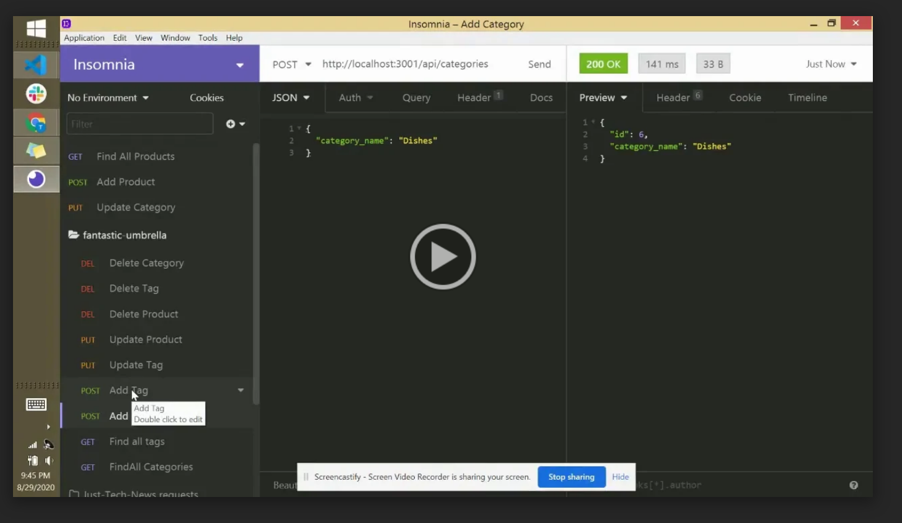
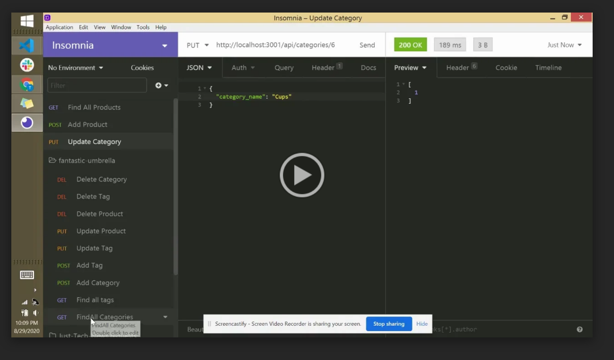

# E-Commerce Back-end Application

## Description
This e-commerce back-end application configures an Express.js API to use Sequelize to interact with a MySQL database. 

Initial models of categories, tags and products are configured and seeded. Routes exist to initiate CRUD operations.
  
## Table of Contents
* [Installation](#installation)
* [Usage](#usage)
* [License](#license)
* [Questions](#questions)
 
## Installation
Clone the repository, then run NPM install.

## Usage
GIVEN a functional Express.js API

WHEN I add my database name, MySQL username, and MySQL password to an environment variable file

THEN I am able to connect to a database using Sequelize

WHEN I enter schema and seed commands

THEN a development database is created and is seeded with test data

WHEN I enter the command to invoke the application

THEN my server is started and the Sequelize models are synced to the MySQL database

WHEN I open API GET routes in Insomnia Core for categories, products, or tags

THEN the data for each of these routes is displayed in a formatted JSON

WHEN I test API POST, PUT, and DELETE routes in Insomnia Core

THEN I am able to successfully create, update, and delete data in my database

### Video Walk-Through Part 1

### Video Walk-Through Part 2

## License
This project is licensed under a ISC License license. 

## Questions
Have additional questions? Contact [cjacktwil](http://github.com.cjacktwil) or email traceyjackson112@gmail.com.
